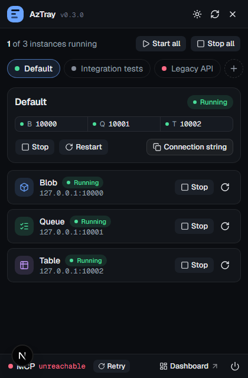
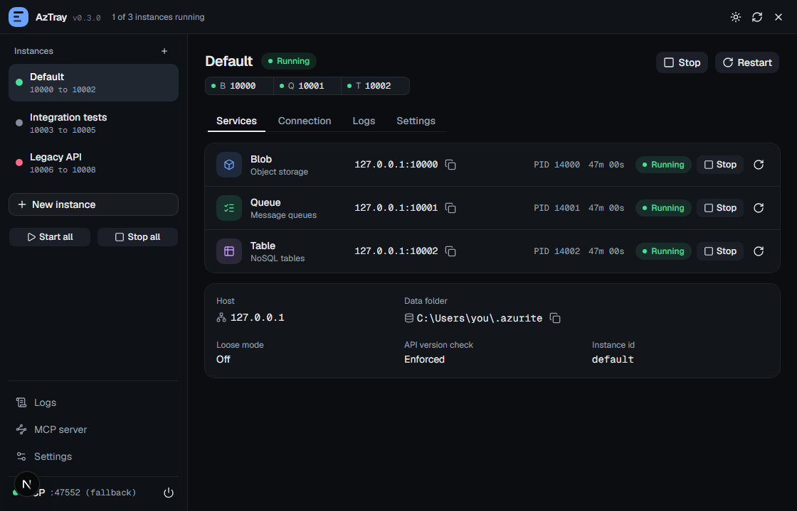
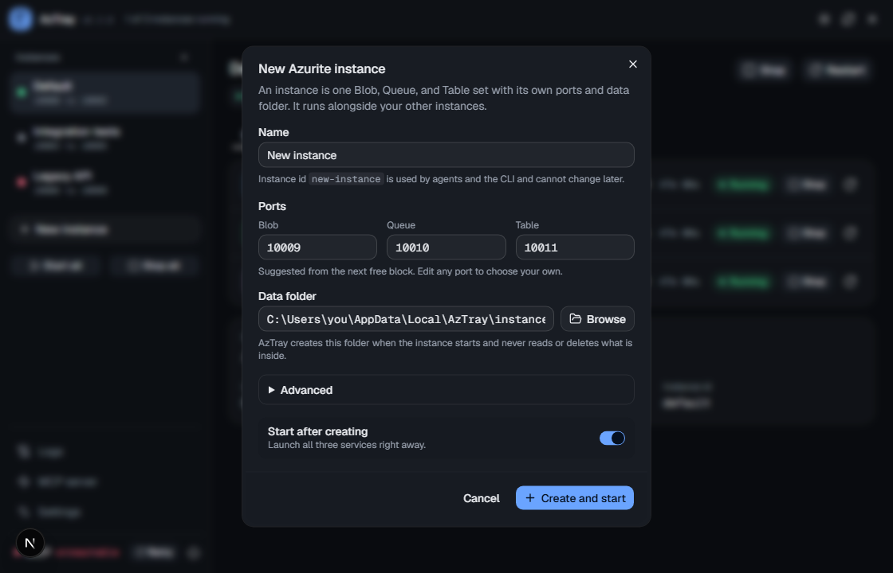
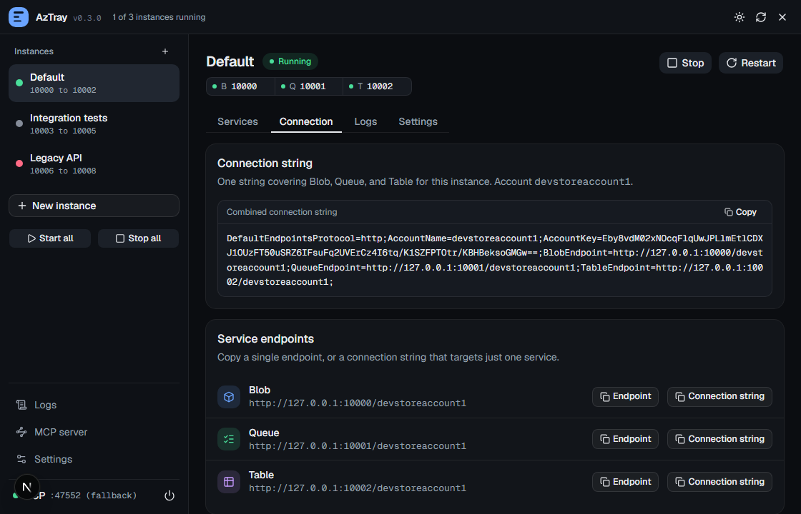
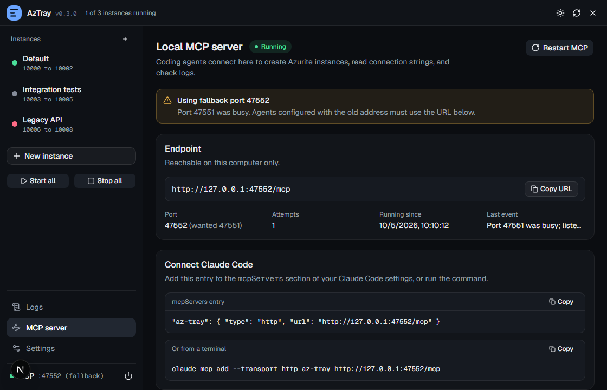
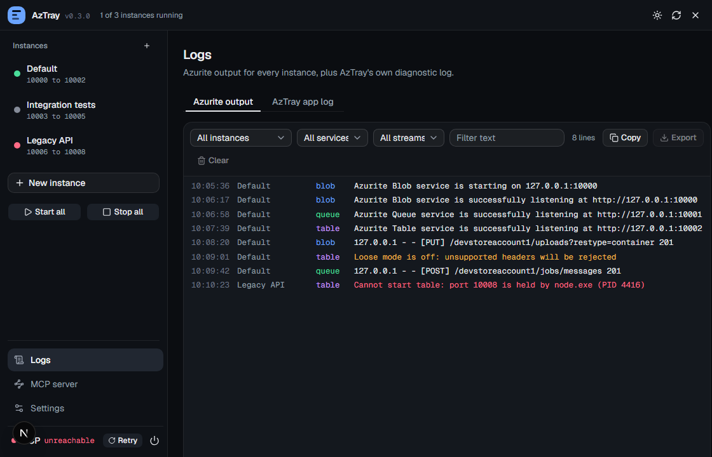

# AzTray

AzTray is a Windows 11 tray controller for local [Azurite](https://github.com/Azure/Azurite) development. It manages Azurite Blob, Queue, and Table processes from a compact tray popover or a small dashboard with live logs, port ownership, connection strings, and settings.





The app is app-only: the installer installs AzTray, while Node.js and Azurite remain a separate user-space prerequisite. AzTray never changes an existing `azctl` installation or Azurite data.

## Use it tomorrow

### 1. Install AzTray

From a standard PowerShell window, run the installer hosted by the public repository:

```powershell
irm https://raw.githubusercontent.com/iAmChumby/az-tray/main/scripts/install.ps1 | iex
```

The script downloads the latest stable x64 release, verifies `SHA256SUMS.txt`, installs under `%LOCALAPPDATA%`, and launches the tray. Running the same command again updates the existing current-user installation in place. The NSIS bundle uses current-user install mode, so the AzTray install and sign-in startup registration do not request UAC elevation.

If AzTray is already running during an update, use the tray menu **Quit AzTray → Stop & quit**, then press Enter in the installer. AzTray closes only the app-owned Azurite services through its own ownership-aware path; the installer waits for the tray process to exit before starting NSIS and leaves it and its child processes intact. A 30-second timeout, `Q` cancellation, an ambiguous install registration, or an unexpected same-name process path leaves the current installation untouched and asks you to retry after resolving the condition. `%APPDATA%\AzTray`, Azurite data directories, and the per-user `HKCU` startup registration remain outside the script's cleanup scope.

You can also download `az-tray-x64-setup.exe` directly from the [latest release](https://github.com/iAmChumby/az-tray/releases/latest) and run it. The release page includes the matching `SHA256SUMS.txt` file.

### 2. Install Node.js and Azurite in your user profile

AzTray can open and show its missing-engine state before this step. To run services, install Node.js first. Use the official [Node.js download page](https://nodejs.org/en/download/) and choose the Windows x64 LTS download. If the MSI is restricted by your work machine, use the Windows x64 standalone ZIP, extract it under `%LOCALAPPDATA%`, and use its `node.exe` and `npm.cmd` directly.

With Node.js available in the current PowerShell session, install Azurite into a user-writable directory:

```powershell
$azuriteRoot = Join-Path $env:LOCALAPPDATA 'AzTrayRuntime\azurite'
New-Item -ItemType Directory -Force -Path $azuriteRoot | Out-Null
npm install --global --prefix $azuriteRoot azurite
```

If Node.js came from a ZIP and is not on `PATH`, prepend its extracted folder before running the command:

```powershell
$nodeRoot = Join-Path $env:LOCALAPPDATA 'AzTrayRuntime\node'
$env:Path = "$nodeRoot;$env:Path"
& (Join-Path $nodeRoot 'npm.cmd') install --global --prefix $azuriteRoot azurite
```

This follows Azurite's official npm installation path and keeps the package under your profile. The global prefix above places `azurite-blob.cmd`, `azurite-queue.cmd`, and `azurite-table.cmd` in `$azuriteRoot`. Run `Write-Output $azuriteRoot` to print the full path for AzTray's Settings field.

### 3. Point AzTray at that install

Open the dashboard from the tray popover, open **Settings**, and set:

- **Azurite executable override:** the full directory path printed by `Write-Output $azuriteRoot` (or the full path to `azurite-blob.cmd`).
- **Node executable override:** the full path to `node.exe` when Node is not already on `PATH`.

Click **Save settings**, then **Refresh**. Start all three services from the popover or dashboard. The default instance uses `127.0.0.1`, Blob `10000`, Queue `10001`, Table `10002`, and data in `%USERPROFILE%\.azurite`.

If the dashboard reports a port conflict, it identifies the owning process before offering **Free port**. AzTray only stops a process after the confirmation action and only treats its own process tree as managed.

### Multiple Azurite instances

An **instance** is one Blob + Queue + Table trio with its own host, ports, and data directory. Create as many as you like from the dashboard's **New instance** dialog (or over MCP) and run them side by side, for example one per project or one per test suite. Each instance has its own start/stop/restart controls, live logs, and settings.

- New instances get the next free port trio automatically (10003-10005, 10006-10008, and so on, skipping anything busy) and their own data directory under `%LOCALAPPDATA%\AzTray\instances\<id>\data`.
- Ports and data directories cannot overlap between instances or with the MCP port range; the error names the instance that owns the conflict.
- Deleting an instance requires it to be stopped and never touches its data on disk.
- Upgrading from v0.2 or earlier migrates your single configuration to an instance named `default` (the original is kept as `%APPDATA%\AzTray\config.v1.json.bak`).
- Quit with **Stop & quit** stops the app-owned services of every instance.



### Connection strings for apps and agents

Each instance shows a **Connection** panel with a combined connection string, per-service strings, and endpoints, all with copy buttons. Strings use the standard `devstoreaccount1` development account:

```text
DefaultEndpointsProtocol=http;AccountName=devstoreaccount1;AccountKey=<dev key>;BlobEndpoint=http://127.0.0.1:10000/devstoreaccount1;QueueEndpoint=http://127.0.0.1:10001/devstoreaccount1;TableEndpoint=http://127.0.0.1:10002/devstoreaccount1;
```



Agents can provision an instance on demand: call `aztray_create_instance` with a `name` and it returns a running instance plus `connection.connectionString`; call `aztray_stop_instance` then `aztray_delete_instance` when finished.

### Connect an MCP client

While the tray app is running, AzTray serves MCP Streamable HTTP at **`http://127.0.0.1:47551/mcp`**. Add that URL as an HTTP MCP server in your LLM client. MCP is enabled by default and needs **AzTray v0.3.0 or later**; earlier releases do not contain the MCP server. Check the version in **Settings → About**.

If port 47551 is taken, AzTray falls back to the next free port (47552 to 47560) and retries automatically if binding fails. The popover footer and the dashboard's **Settings → Local MCP** card show the live URL, port, last event, any error, and a **Retry** button. Turn off port fallback in that card if you need a fixed URL.



Agents setting this up themselves should follow the [AzTray MCP installation and client setup guide](docs/AGENT-MCP-SETUP.md). It covers installing the release, registering the local server in Codex or another MCP client, and verifying the connection.

The tools cover the app's management surface: inspect the live snapshot and runtime, create/update/delete instances, start/stop/restart each service, instance, or everything, inspect and release a configured port owner, read/save/clear logs, get connection strings, read the AzTray app log, and quit AzTray. Tools that act on an instance take an optional `instance` argument (id or name); omit it to target the default or only instance. The endpoint accepts both the current MCP request-metadata protocol (`2026-07-28`) and the older `2025-11-25` initialization flow. A client can discover exact tool names and argument schemas with `tools/list`.

The server binds only to loopback and checks HTTP Host and Origin. MCP clients can perform the same consequential operations as the UI. In particular, `aztray_free_port` requires the observed PID and process start time plus `confirmed: true`; AzTray checks identity again before terminating that port owner. Connect trusted local clients and review their proposed tool calls. AzTray manages Azurite processes and settings; it does not browse or edit stored Blob, Queue, or Table data.

### Logs and failed starts

Service output and startup diagnostics appear in the dashboard's **Live logs** panel while AzTray is running. Azurite output stays in memory until you click **Export logs** and choose a `.txt` destination in the native save dialog. Export the merged view to share all of an instance's output, or select a service to export only its logs.

AzTray's own events (startup, MCP bind attempts and failures, port fallback, config migration) are written to **`%APPDATA%\AzTray\logs\aztray.log`**, rotated at 1 MB to `aztray.log.1`. The dashboard's **Settings → Diagnostics** section shows the path and the most recent lines. Attach this file when reporting an issue.



## Runtime prerequisites

- Windows 11 x64 is the first supported target.
- Node.js is required to run Azurite; AzTray itself is a native Tauri app.
- The installer skips the WebView2 bootstrapper. Windows 11 normally includes the Evergreen WebView2 Runtime. On a managed, LTSC, or otherwise unusual Windows image, install the [Evergreen WebView2 Runtime](https://developer.microsoft.com/microsoft-edge/webview2/) separately if Windows reports that the app cannot initialize its WebView.
- Closing a window returns to the tray. **Quit** asks whether AzTray should stop its app-owned services or leave them running.

## Build locally

```powershell
npm ci
npm run typecheck
npm run tauri build
```

The build exports the Next.js frontend to `out/` and packages it into a current-user NSIS installer. See [`scripts/README.md`](scripts/README.md) for installer parameters and the local fresh-install harness.

## Uninstall safely

From a checkout of this repository:

```powershell
powershell -NoProfile -ExecutionPolicy Bypass -File .\scripts\uninstall.ps1
```

From Git Bash:

```bash
bash ./scripts/uninstall.sh
```

The uninstaller removes AzTray binaries and the exact AzTray per-user startup value. It preserves `%APPDATA%\AzTray` settings, the existing `azctl` configuration, and all Azurite data directories. The `%LOCALAPPDATA%\AzTray` install directory is removed by NSIS.

## License

AzTray is MIT-licensed. See [`LICENSE`](LICENSE).
